# 🎬 Cinema Booking

Web đặt vé xem phim: chọn ghế **theo thời gian thực**, giữ ghế có đếm ngược, thanh toán, vé điện tử có QR, soát vé cho nhân viên và báo cáo doanh thu cho quản trị.


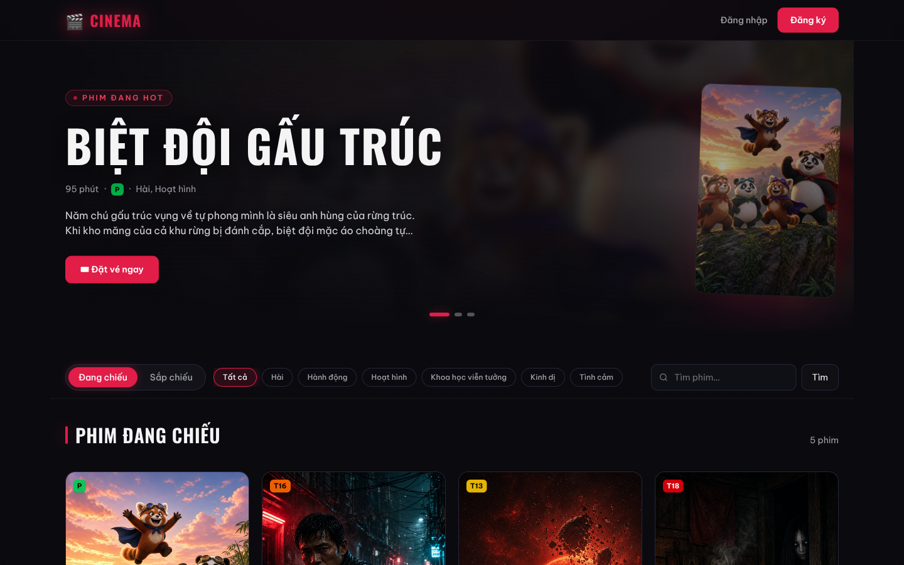

## Mục lục

- [Tính năng](#tính-năng)
- [Ảnh chụp ứng dụng](#ảnh-chụp-ứng-dụng)
- [Thiết kế giao diện (Stitch)](#thiết-kế-giao-diện-stitch)
- [Kiến trúc](#kiến-trúc)
- [Tech stack](#tech-stack)
- [Bắt đầu nhanh](#bắt-đầu-nhanh)
- [Dữ liệu demo và tài khoản](#dữ-liệu-demo-và-tài-khoản)
- [Cấu hình môi trường](#cấu-hình-môi-trường)
- [API](#api)
- [Realtime: WebSocket sơ đồ ghế](#realtime-websocket-sơ-đồ-ghế)
- [Job nền (Celery)](#job-nền-celery)
- [Kiểm thử](#kiểm-thử)
- [Cấu trúc thư mục](#cấu-trúc-thư-mục)
- [Giới hạn hiện tại](#giới-hạn-hiện-tại)

## Tính năng

**Khách hàng**
- Duyệt phim đang chiếu / sắp chiếu, lọc theo thể loại, tìm theo tên; hero carousel phim nổi bật.
- Xem chi tiết phim và lịch chiếu theo ngày, theo rạp.
- Sơ đồ ghế realtime: thấy ngay ghế người khác đang giữ hoặc vừa bán. Có ghế thường, VIP và ghế đôi.
- Giữ ghế 10 phút với đồng hồ đếm ngược; hết giờ thì ghế tự nhả và đơn chuyển sang "Hết hạn".
- Thêm combo bắp nước, áp mã giảm giá (phần trăm hoặc số tiền cố định, có giới hạn lượt dùng).
- Thanh toán qua cổng giả lập; nhận vé điện tử có mã QR và email xác nhận.
- Lịch sử đặt vé, cập nhật thông tin tài khoản.

**Nhân viên (`staff`)**
- Soát vé bằng camera quét QR hoặc nhập mã vé, có kiểm tra khung giờ mở soát vé.

**Quản trị (`admin`)**
- Dashboard doanh thu theo ngày, top phim, tỉ lệ lấp đầy phòng.
- Quản lý phim, rạp, phòng, suất chiếu, combo, voucher qua Django admin; sinh sơ đồ ghế tự động.

**Kỹ thuật đáng chú ý**
- Chống đặt trùng ghế hai lớp: giữ ghế nguyên tử bằng Lua script trên Redis, và partial unique index `(showtime, seat)` trong PostgreSQL làm chốt chặn cuối.
- Webhook thanh toán ký HMAC-SHA256 và xử lý idempotent.
- WebSocket xác thực bằng JWT, có snapshot khi kết nối và cơ chế `resync`.
- Rate limit theo từng nhóm endpoint (đăng nhập, giữ ghế, thanh toán, voucher, soát vé).
- Health check `/healthz`, `/readyz`; log JSON; tích hợp Sentry (tuỳ chọn).

## Ảnh chụp ứng dụng

Ảnh chụp từ ứng dụng đang chạy với dữ liệu demo.

| Chi tiết phim | Chọn ghế realtime |
|---|---|
| 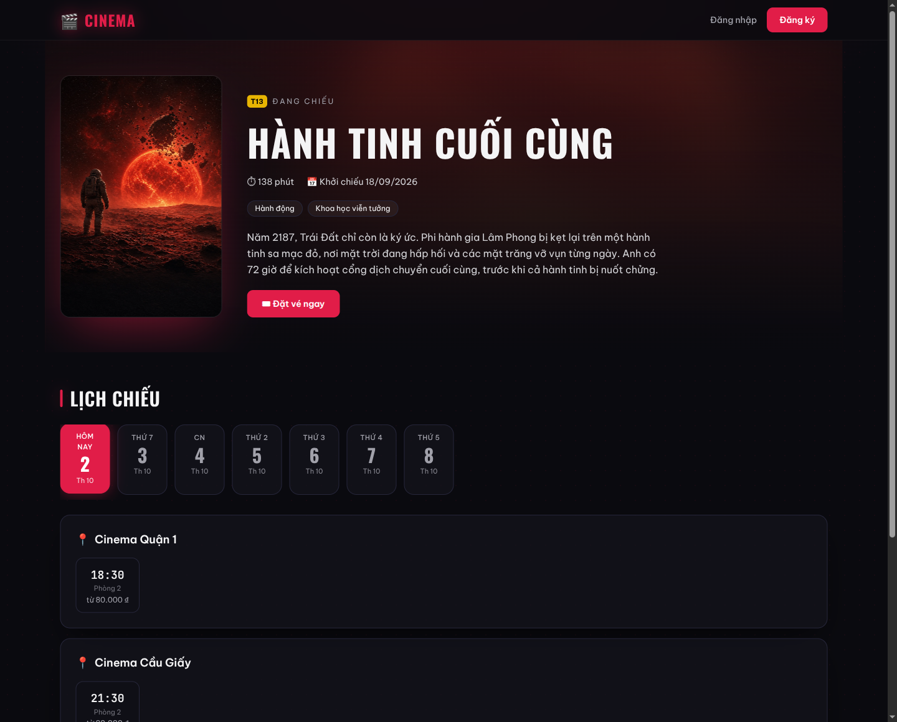 | 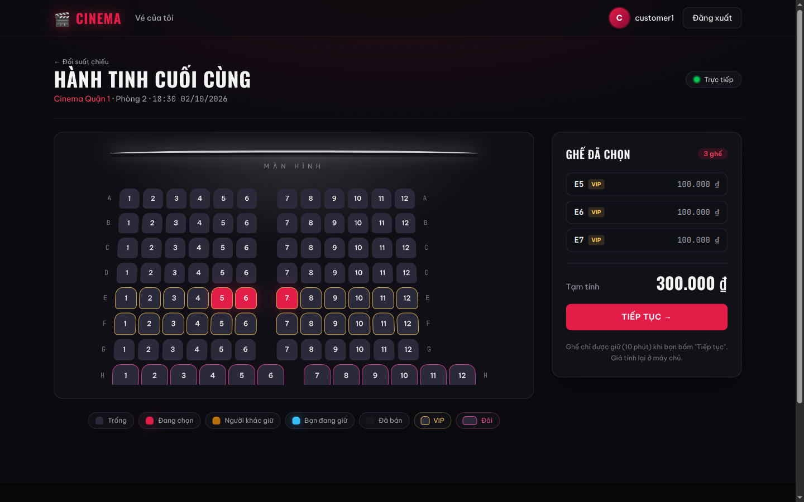 |

| Chờ thanh toán | Vé điện tử | Đơn hết hạn |
|---|---|---|
| 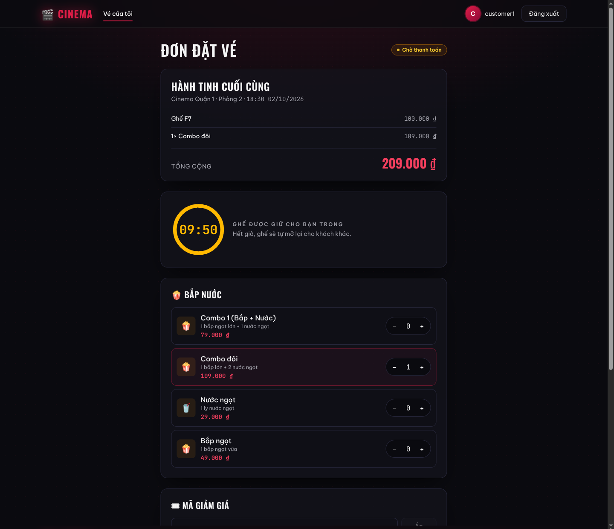 | 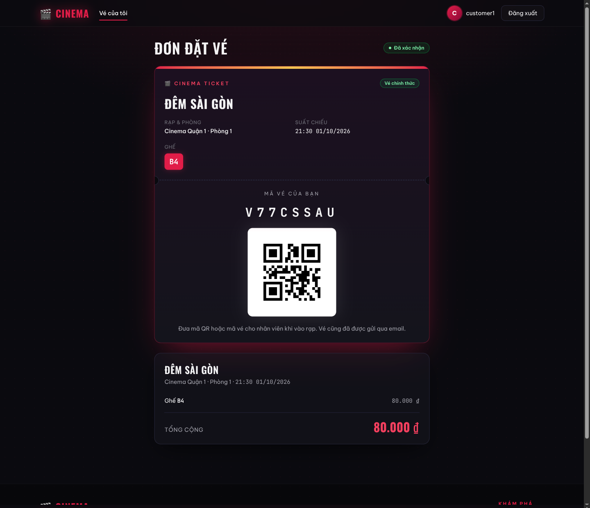 | 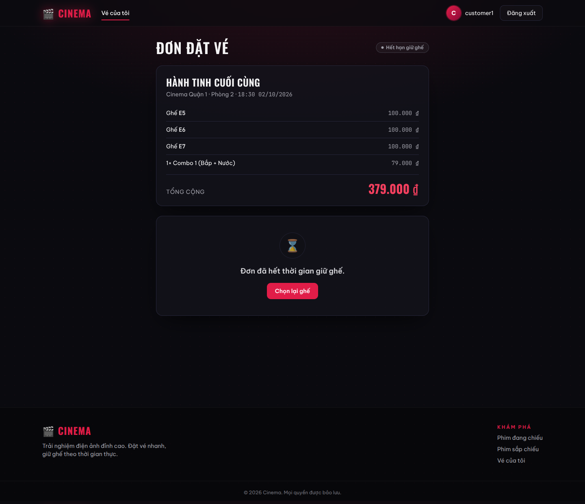 |

## Thiết kế giao diện (Stitch)

Giao diện được thiết kế trên [Google Stitch](https://stitch.withgoogle.com) với design system **"Cinema Noir"**: nền đen rạp chiếu, điểm nhấn đỏ `#E11D48`, vàng `#F5C451` cho VIP, hồng `#EC4899` cho ghế đôi. Chi tiết màu, typography, component và motion nằm trong [`.stitch/DESIGN.md`](.stitch/DESIGN.md). Bấm vào ảnh để xem toàn trang.

| | |
|---|---|
| **Trang chủ**<br>[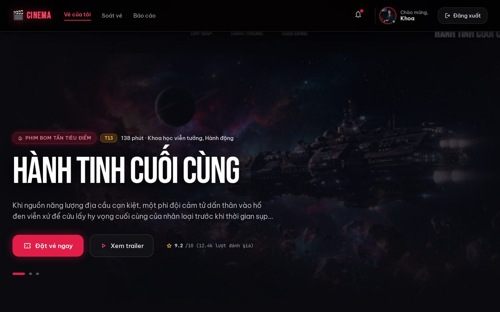](docs/design/01-home.jpg) | **Chi tiết phim & lịch chiếu**<br>[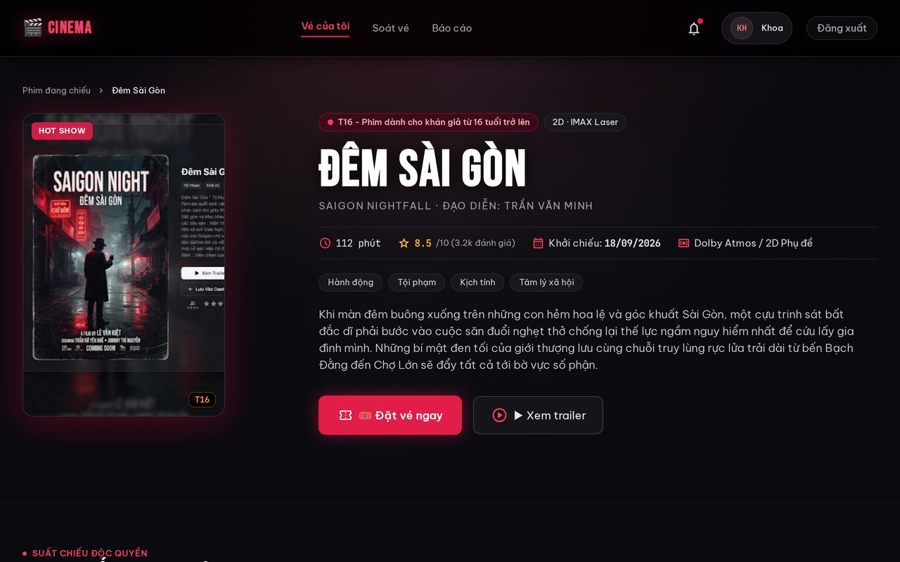](docs/design/02-movie-detail.jpg) |
| **Chọn ghế**<br>[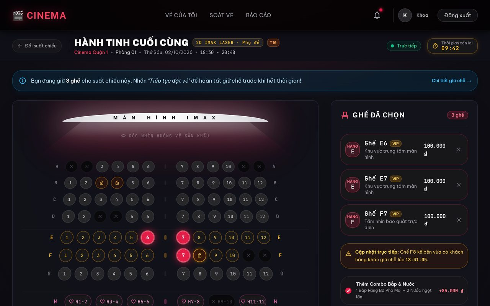](docs/design/03-seat-selection.jpg) | **Đơn đặt vé**<br>[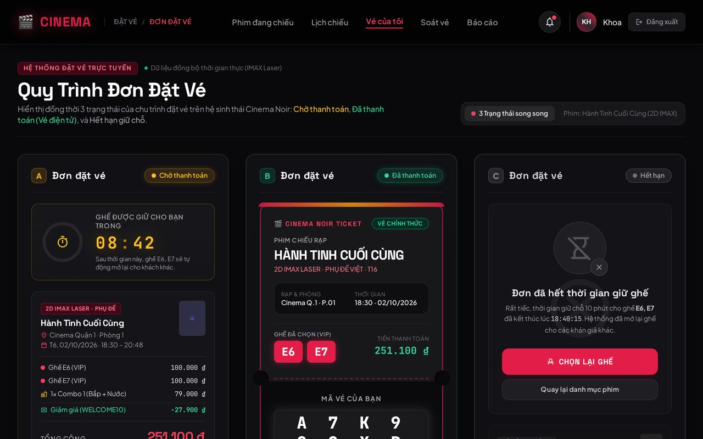](docs/design/04-booking.jpg) |
| **Vé của tôi & Tài khoản**<br>[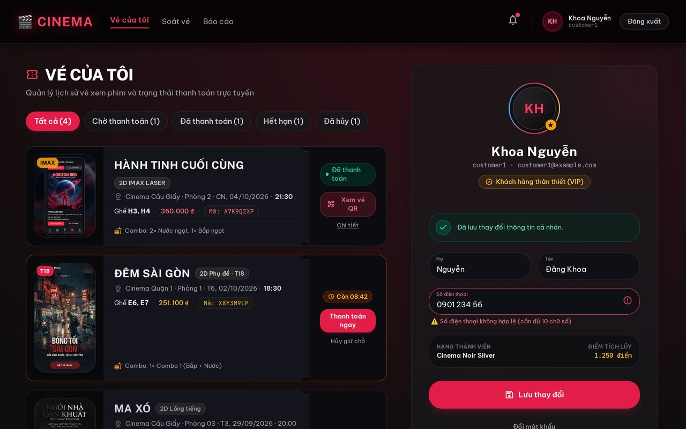](docs/design/05-my-tickets-account.jpg) | **Đăng nhập, Đăng ký, 404**<br>[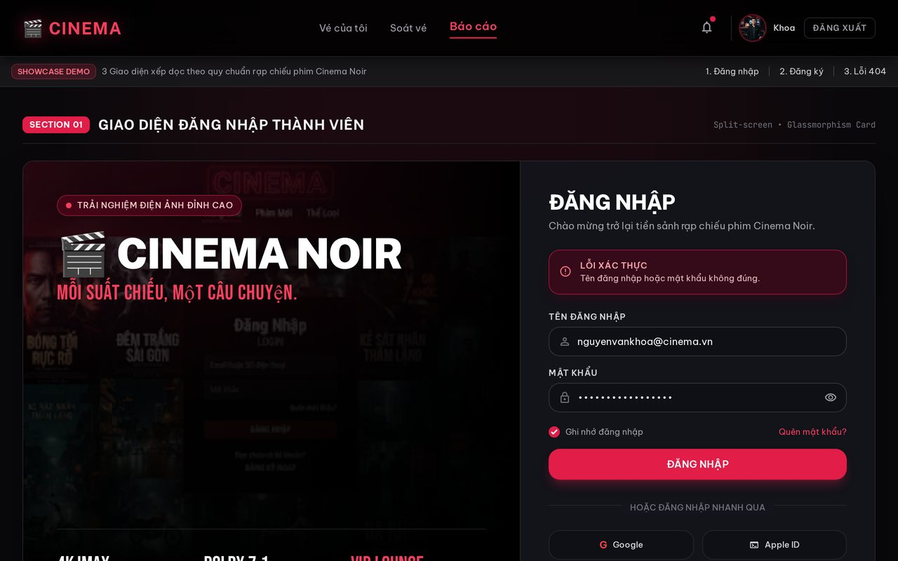](docs/design/06-auth-404.jpg) |
| **Soát vé (staff)**<br>[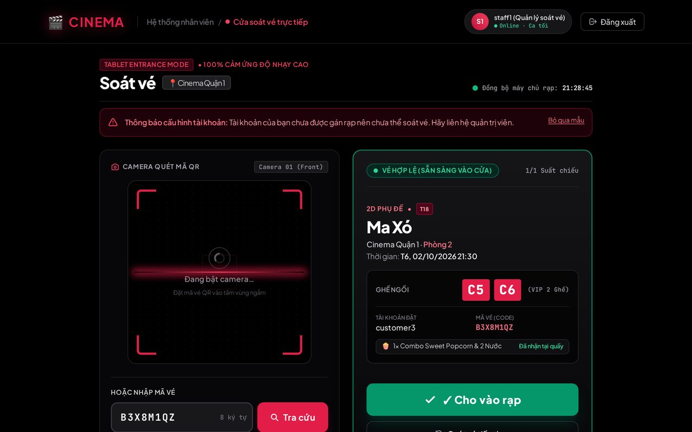](docs/design/07-staff-checkin.jpg) | **Báo cáo (admin)**<br>[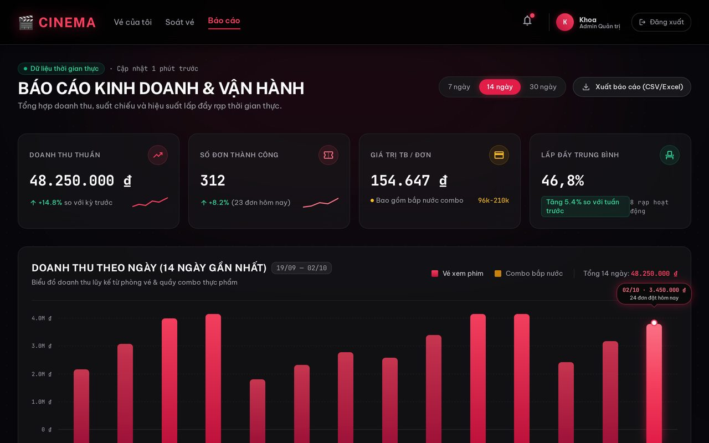](docs/design/08-admin-dashboard.jpg) |

Font thực tế trong code: **Oswald** cho tiêu đề (thay Bebas Neue vì Bebas Neue không có dấu tiếng Việt), **Be Vietnam Pro** cho nội dung, **JetBrains Mono** cho mã vé và số tiền.

## Kiến trúc

Modular monolith: một project Django chia thành nhiều app theo domain, chạy ASGI (Daphne) để phục vụ cả REST lẫn WebSocket.

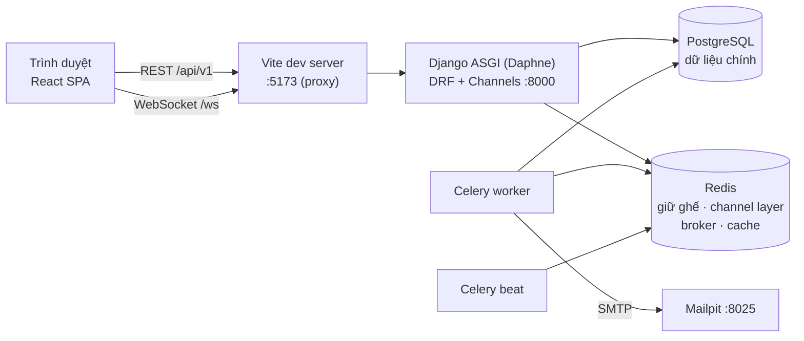
```mermaid
flowchart LR
    B["Trình duyệt<br/>React SPA"] -- "REST /api/v1" --> V["Vite dev server<br/>:5173 (proxy)"]
    B -- "WebSocket /ws" --> V
    V --> D["Django ASGI (Daphne)<br/>DRF + Channels :8000"]
    D --> P[("PostgreSQL<br/>dữ liệu chính")]
    D --> R[("Redis<br/>giữ ghế · channel layer<br/>broker · cache")]
    W["Celery worker"] --> R
    W --> P
    BT["Celery beat"] --> R
    W -- "SMTP" --> M["Mailpit :8025"]
```

### Luồng giữ ghế và thanh toán

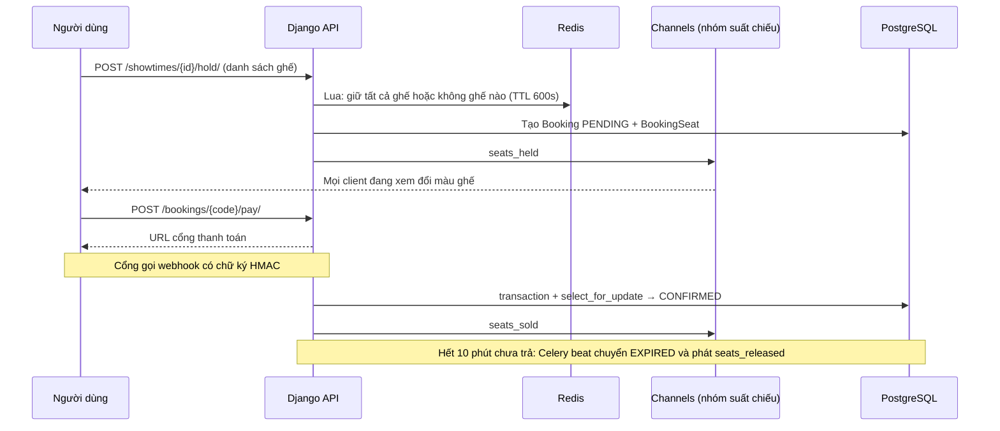
```mermaid
sequenceDiagram
    participant U as Người dùng
    participant API as Django API
    participant R as Redis
    participant WS as Channels (nhóm suất chiếu)
    participant DB as PostgreSQL
    U->>API: POST /showtimes/{id}/hold/ (danh sách ghế)
    API->>R: Lua: giữ tất cả ghế hoặc không ghế nào (TTL 600s)
    API->>DB: Tạo Booking PENDING + BookingSeat
    API->>WS: seats_held
    WS-->>U: Mọi client đang xem đổi màu ghế
    U->>API: POST /bookings/{code}/pay/
    API-->>U: URL cổng thanh toán
    Note over U,API: Cổng gọi webhook có chữ ký HMAC
    API->>DB: transaction + select_for_update → CONFIRMED
    API->>WS: seats_sold
    Note over API,DB: Hết 10 phút chưa trả: Celery beat chuyển EXPIRED và phát seats_released
```

## Tech stack

| Lớp | Công nghệ |
|---|---|
| Backend | Django 5.2, Django REST Framework, SimpleJWT (refresh + blacklist), django-filter, drf-spectacular |
| Realtime | Django Channels 4 + channels-redis, Daphne |
| Job nền | Celery 5 + Celery Beat (broker Redis) |
| Dữ liệu | PostgreSQL 16, Redis 7 |
| Frontend | React 19, TypeScript, Vite 8, Tailwind CSS 4, TanStack Query 5, React Router, Zustand, jsQR |
| Khác | qrcode (vé QR dạng SVG), Mailpit (email dev), Sentry SDK |
| Test | Django test runner, Vitest + jsdom |
| Hạ tầng | Docker Compose |

## Bắt đầu nhanh

Yêu cầu: Docker và Docker Compose v2.

**1. Tạo file `.env`**

```bash
cp .env.example .env
```

Điền hai giá trị bắt buộc (sinh bằng lệnh có sẵn trong comment của `.env.example`):

```bash
python3 -c "import secrets; print(secrets.token_urlsafe(50))"   # DJANGO_SECRET_KEY
python3 -c "import secrets; print(secrets.token_urlsafe(32))"   # PAYMENT_WEBHOOK_SECRET
```

> Tránh ký tự `$` trong giá trị (Docker Compose coi đó là biến). Nếu đổi `POSTGRES_PASSWORD`, nhớ sửa luôn trong `DATABASE_URL` và percent-encode ký tự đặc biệt.

**2. Chạy toàn bộ stack**

```bash
docker compose up -d --build
```

**3. Tạo bảng, nạp dữ liệu demo và tài khoản admin**

```bash
docker compose exec backend python manage.py migrate
docker compose exec backend python manage.py seed_demo         # thể loại, 6 phim, 2 rạp, phòng, ghế, suất chiếu 7 ngày
docker compose exec backend python manage.py seed_promotions   # combo bắp nước và voucher
docker compose exec backend python manage.py seed_sales        # (tuỳ chọn) nhân viên, khách, lịch sử bán vé 14 ngày
docker compose exec backend python manage.py createsuperuser   # superuser tự động có role admin
```

Các lệnh seed chạy lại nhiều lần vẫn an toàn.

**4. Mở ứng dụng**

| Dịch vụ | URL |
|---|---|
| Frontend | http://localhost:5173 |
| API | http://localhost:8000/api/v1/ |
| Swagger UI (khi `DJANGO_DEBUG=1`) | http://localhost:8000/api/docs/ |
| Django admin | http://localhost:8000/admin/ |
| Mailpit (hộp thư dev) | http://localhost:8025 |

## Dữ liệu demo và tài khoản

`seed_sales` tạo sẵn các tài khoản sau:

| Vai trò | Email | Mật khẩu |
|---|---|---|
| Nhân viên | `staff1@example.com` | `Staff!Pass_123` |
| Khách hàng | `customer1@example.com` … | `Customer!Pass_123` |

Tài khoản admin là superuser tạo bằng `createsuperuser`. Đăng nhập được bằng email hoặc username.

Voucher mẫu từ `seed_promotions`: `WELCOME10` (giảm 10%, tối đa 30.000đ), `SAVE20K` (giảm 20.000đ), `FLASH50` (giảm 50%, chỉ 2 lượt).

Poster phim nằm ở `frontend/public/posters/`. Khi frontend chạy ở domain khác, chạy `seed_demo --asset-base https://ten-mien-cua-ban` để link poster trỏ đúng.

## Cấu hình môi trường

Các biến chính (xem đầy đủ trong [`.env.example`](.env.example)):

| Biến | Mặc định | Ý nghĩa |
|---|---|---|
| `DJANGO_SECRET_KEY` | (bắt buộc) | Secret key của Django |
| `DJANGO_DEBUG` | `0` | Bật chế độ dev, Swagger và cổng thanh toán giả lập |
| `DATABASE_URL` | | Chuỗi kết nối PostgreSQL |
| `REDIS_URL` / `CELERY_BROKER_URL` / `CACHE_URL` | Redis DB 0 / 1 / 2 | Giữ ghế + channel layer / Celery / cache và throttling |
| `PAYMENT_WEBHOOK_SECRET` | (bắt buộc) | Khoá HMAC ký webhook thanh toán |
| `PAYMENT_MOCK_ENABLED` | theo `DJANGO_DEBUG` | Bật cổng thanh toán giả lập `/mock-gateway/` |
| `SEAT_HOLD_SECONDS` | `600` | Thời gian giữ ghế |
| `MAX_SEATS_PER_BOOKING` | `8` | Số ghế tối đa mỗi đơn |
| `CHECKIN_OPENS_BEFORE_MINUTES` | `60` | Mở soát vé trước giờ chiếu bao nhiêu phút |
| `CORS_ALLOWED_ORIGINS` | `http://localhost:5173` | Origin được phép gọi API |
| `NUM_PROXIES` | `0` | Số reverse proxy tin cậy (ảnh hưởng IP dùng cho rate limit) |
| `SENTRY_DSN` | | Bật Sentry khi có giá trị |

## API

Tiền tố `/api/v1/`, xác thực bằng header `Authorization: Bearer <access_token>`. Tài liệu đầy đủ ở Swagger `/api/docs/`.

| Nhóm | Endpoint | Quyền |
|---|---|---|
| Xác thực | `POST auth/register/`, `auth/login/`, `auth/refresh/`, `auth/logout/`; `GET/PATCH auth/me/` | Công khai / đăng nhập |
| Danh mục | `genres/`, `movies/`, `cinemas/`, `rooms/`, `combos/` | Đọc công khai, ghi cho admin |
| Suất chiếu | `showtimes/`, `GET showtimes/{id}/seats/` | Đọc công khai, ghi cho admin |
| Giữ ghế | `POST showtimes/{id}/hold/` | Đăng nhập |
| Đơn đặt vé | `GET bookings/`, `bookings/{code}/`, `POST …/cancel/`, `GET …/qr/`, `PUT …/combos/`, `PUT/DELETE …/voucher/` | Chủ đơn |
| Thanh toán | `POST bookings/{code}/pay/`, `POST payments/webhook/mock/` | Chủ đơn / chữ ký HMAC |
| Soát vé | `GET staff/tickets/{code}/`, `POST staff/checkin/` | Staff, admin |
| Báo cáo | `GET reports/revenue/`, `reports/top-movies/`, `reports/occupancy/` | Admin |

## Realtime: WebSocket sơ đồ ghế

```
ws://localhost:5173/ws/showtimes/{showtime_id}/seats/?token=<access_token>
```

Không có token vẫn xem được sơ đồ, nhưng không biết ghế nào là của mình.

| Hướng | Thông điệp |
|---|---|
| Server → client | `{"type": "snapshot", "held": [...], "mine": [...], "sold": [...]}` khi vừa kết nối hoặc khi `resync` |
| Server → client | `{"type": "seats_held" \| "seats_released" \| "seats_sold", "seat_ids": [...]}` |
| Client → server | `{"type": "ping"}` (nhận `pong`) · `{"type": "resync"}` |

## Job nền (Celery)

| Task | Lịch | Việc làm |
|---|---|---|
| `bookings.expire_pending` | mỗi 10 giây | Chuyển đơn quá hạn sang `EXPIRED`, nhả ghế, phát `seats_released` |
| `users.flush_expired_tokens` | 3:00 hằng ngày | Dọn refresh token đã hết hạn |
| Email chào mừng / xác nhận vé | theo sự kiện | Gửi sau khi transaction commit; xem thư ở Mailpit |

## Kiểm thử

```bash
# Backend (Django test runner)
docker compose exec backend python manage.py test

# Frontend
docker compose exec frontend npm test
docker compose exec frontend npm run lint
docker compose exec frontend npm run build   # gồm kiểm tra kiểu bằng tsc
```

Test backend bao phủ giữ ghế đồng thời, checkout, webhook thanh toán, soát vé, voucher/combo, báo cáo, WebSocket, task Celery và rate limit.

## Cấu trúc thư mục

```
cinema-booking/
├── backend/
│   ├── config/              # settings, urls, asgi (HTTP + WebSocket), celery
│   └── apps/
│       ├── users/           # User + role (customer/staff/admin), JWT, xác thực WebSocket
│       ├── movies/          # Genre, Movie
│       ├── cinemas/         # Cinema, Room, Seat, sinh sơ đồ ghế
│       ├── showtimes/       # Showtime, kiểm tra trùng lịch, lệnh seed_demo / seed_sales
│       ├── bookings/        # Giữ ghế (Redis), checkout, consumer WebSocket, soát vé, task hết hạn
│       ├── payments/        # Payment, cổng giả lập, webhook HMAC
│       ├── promotions/      # Combo, Voucher, lệnh seed_promotions
│       ├── reports/         # Doanh thu, top phim, tỉ lệ lấp đầy
│       └── core/            # Health check, throttling, xử lý lỗi, logging, Sentry
├── frontend/
│   ├── public/posters/      # Poster phim demo
│   └── src/
│       ├── api/             # HTTP client (tự refresh token), endpoints, types
│       ├── auth/            # Store đăng nhập, RequireAuth, RequireRole
│       ├── components/      # Layout, AuthShell, UI dùng chung, class Tailwind
│       └── features/        # movies, showtimes, bookings, auth, staff, admin
├── docs/
│   ├── screenshots/         # Ảnh chụp ứng dụng
│   └── design/              # Ảnh thiết kế Stitch (đã nén)
├── .stitch/DESIGN.md        # Design system "Cinema Noir"
├── docker-compose.yml       # db, redis, mailpit, backend, worker, beat, frontend
└── .env.example
```

## Giới hạn hiện tại

- Chỉ có cổng thanh toán giả lập; chưa tích hợp VNPay/MoMo thật.
- `docker-compose.yml` dành cho môi trường dev (`runserver`, Vite dev server). Chưa có cấu hình production với Nginx và HTTPS.
- Chưa có CI/CD và test E2E.
